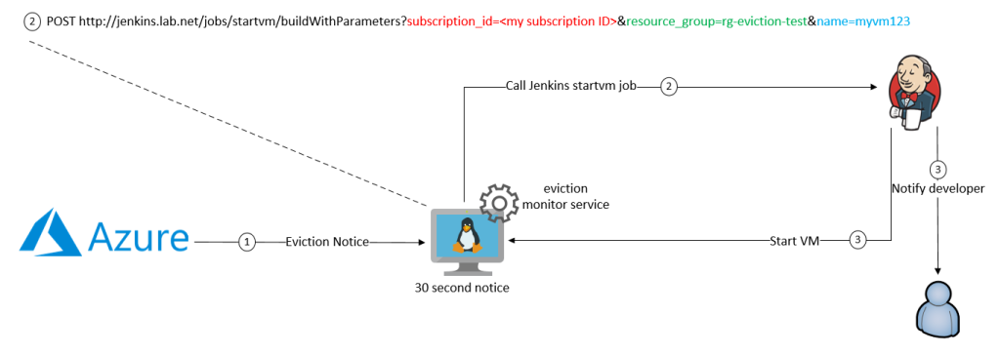
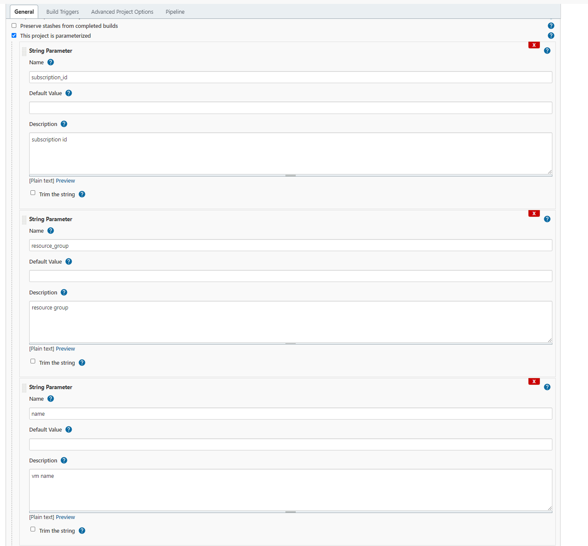
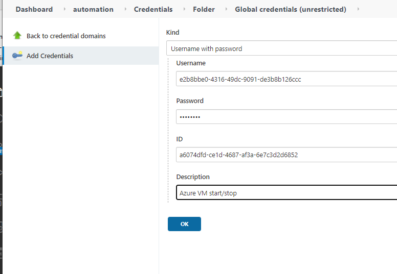
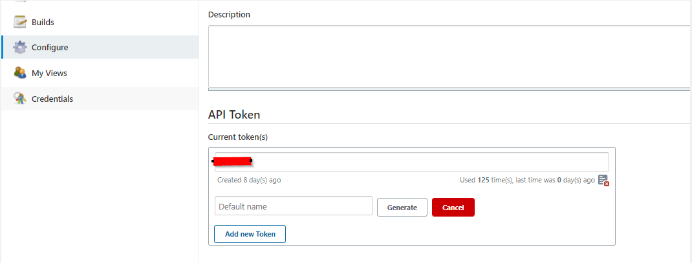

# Description

Use eviction-notify service to notify Jenkins that your Azure Spot Instance which has been evicted should be turned back on.
For more details refernece my [detailed blog post](https://runops.wordpress.com/2021/04/25/how-to-save-a-fortune-with-azure-spot-instances-in-your-dev-pre-production-environments/)  

## Installation and Setup of eviction_notify

## Setp 1

Setup the following paramters in your Jenkins

Type: String  
Parameter name: subscription_id  
Description: Azure subscription  
Defaults: no default  

Type: String  
Parameter name: resource_group  
Description: Azure resource group of VM  
Defaults: no default  

Type: String  
Parameter name: name  
Descrition: Azure VM name  
Defaults: no default  

Type: String  
Parameter name: TENANT  
Descrition Azure Tenant  
Defaults: set your tenant as the defualt value  

## Step 2

Create a service principle in Azure [using this guide](https://docs.microsoft.com/en-us/azure/active-directory/develop/howto-create-service-principal-portal)  
The service principle must have permissions to turn on/off VMs. You can use the built Role [Virtual Machine Contributor](https://docs.microsoft.com/en-us/azure/role-based-access-control/built-in-roles#virtual-machine-contributor) however this is far to much permissions.  

I recommend create a custom role which only has VM start/stop permissions. There is a good post [Stackoverflow](https://stackoverflow.com/questions/23668154/allow-users-to-start-stop-particular-azure-vms/49925159)  

Once you have the service principle created, setup the credential in Jenkins.  
Setup Jenkins credential username/password with and name the credential the same name as the Azure subscription  
For example: a6074dfd-ce1d-4687-af3a-6e7c3d2d6852  
This way when the HTTP POST comes in from the VM, the parameter subscription_id will be used to 'lookup' the correct Azure SPN username/password. Which will be used by the az cli to login and start the VM.

## Step 3

Setup a user who has permissions to run the Jenkins Job  

Create API token for the user  

Go to the user's profile then add new Token, save the token as after you exit this screen the token will not longer be accessible.  

## Step 4

Configure the Jenkins Job to use the Jenkins file this repository  
Jenkins file can either copy/pasted in or pulled from SCM  

## Step 5

Update the environment variables in the eviction-notify.service file  
Example of my jenkins job path: http://10.111.252.21:8080/job/automation/job/startvm/buildWithParameters?  
In my example I created a folder named automation with pipeline job name startvm. 

    Environment="JENKINS_USERNAME={your jenkins user}"
    Environment="JENKINS_PASSWORD={your jenkins user api token}"
    Environment="JENKINS_URI={URL for jenkins startvm job}"

## Step 6
Install and enable service  

    cp eviction-notify.service /etc/systemd/system/eviction-notify.service
    cp eviction_notify.py /opt
    systemctl enable eviction-notify 
    systemctl start eviction-notify
